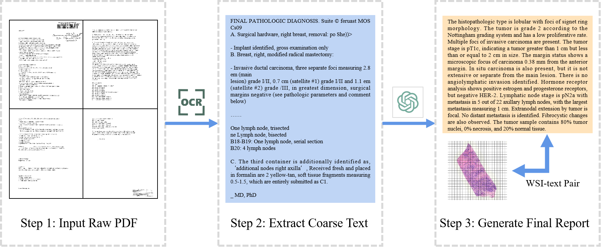

# MI-Gen: Multiple Instance Generation of Pathology Reports for Gigapixel Whole Slide Images

=====
<details>
<summary>
    <b>MI-Gen: Multiple Instance Generation of Pathology Reports for Gigapixel Whole Slide Images</b>.
      <a href="https://arxiv.org/abs/2311.16480" target="blank">[Link]</a>
      <br><em>Pingyi Chen, Honglin Li, Chenglu Zhu, Sunyi Zheng, Lin Yang </em></br>
</summary>
</details>
 <b>Summary:</b>1. We propose a pipeline to curate high-quality WSI-text pairs from TCGA. The dataset (TCGA-PathoText) contains about ten thousand pairs which will be publicly accessible. It can potentially promote the development of visual-language models in pathology. 2. We design a multiple instance generation framework(MI-Gen). By incorporating the position-aware module, our model is more sensitive to the spatial information in WSIs.


## Pre-requisites:
We will share our collected slide-level captions but WSIs still need to be downloaded due to their large resolution.
### Downloading TCGA Slides
To download diagnostic WSIs (formatted as .svs files), please refer to the [NIH Genomic Data Commons Data Portal](https://portal.gdc.cancer.gov/). WSIs for each cancer type can be downloaded using the [GDC Data Transfer Tool](https://docs.gdc.cancer.gov/Data_Transfer_Tool/Users_Guide/Data_Download_and_Upload/).

### Processing Whole Slide Images
To process WSIs, first, the tissue regions in each biopsy slide are segmented using Otsu's Segmentation on a downsampled WSI using OpenSlide. The 256 x 256 patches without spatial overlapping are extracted from the segmented tissue regions at the desired magnification. Consequently, a pretrained truncated ResNet50 is used to encode raw image patches into 1024-dim feature vectors, which we then save as .pt files for each WSI. We achieve the pre-processing of WSIs by using <a href="https://github.com/mahmoodlab/CLAM" target="blank"><b>CLAM</b></a>

### TCGA-PathoText: Slide-Text captions
We notice that TCGA includes scanning copies of pathology reports in the format of PDF1. But they are too long with redundant information and present in a complex structure. Therefore, we propose a pipeline to extract and clean pathological texts from TCGA, which can convert complex PDF files to concise WSI-text pairs with the assistance of large language models (LLM).



Our dataset can be downloaded online now. The following folder structure is assumed for the TCGA-PathoText:
```bash
TCGA-PathoText/
    └──TCGA_BLCA/
        ├── case_1
              ├──annotation ##(slide-level captions we obtained by ocr and GPT)
              ├──case_1.pdf ##(softlink to the corresponding raw TCGA report)
              └── ...
        ├── case_2
        └── ...
    └──TCGA_BRCA/
        ├── case_1
        ├── case_2
        └── ...
    ...

TCGA-Slide-Features/
    └──TCGA_BLCA/
        ├── case_1.pt
        ├── case_2.pt
        └── ...
    └──TCGA_BRCA/
        ├── case_1.pt
        ├── case_2.pt
        └── ...
    ...
```
TCGA-PathoText contains the captions and TCGA-Slide-Features includes the extracted features of WSIs.

## Running Experiments
Experiments can be run using the following generic command-line:
### Training model
```shell
CUDA_VISIBLE_DEVICES=<DEVICE ID> python main.py --mode 'Train' --image_dir <SLIDE FEATURE PATH> --ann_path <CAPTION PATH> --split_path <PATH to the directory containing the train/val/test splits> 
```
### Testing model
```shell
python main.py --mode 'Test' --image_dir <SLIDE FEATURE PATH> --ann_path <CAPTION PATH> --split_path <PATH to the directory containing the train/val/test splits> --checkpoint_dir <PATH TO CKPT>
```

## Basic Environment
* Linux (Tested on Ubuntu 18.04) 
* NVIDIA GPU (Tested on Nvidia GeForce A100) with CUDA 12.0
* Python (3.8)

